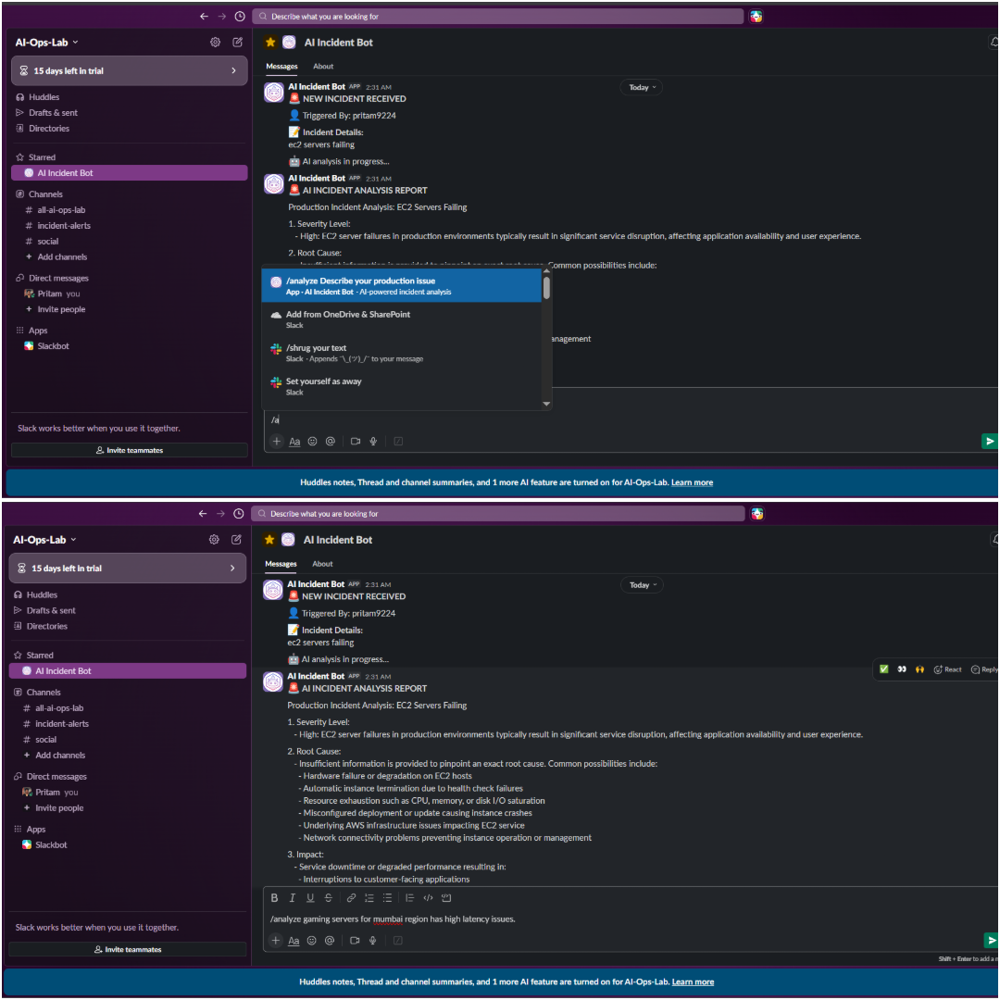
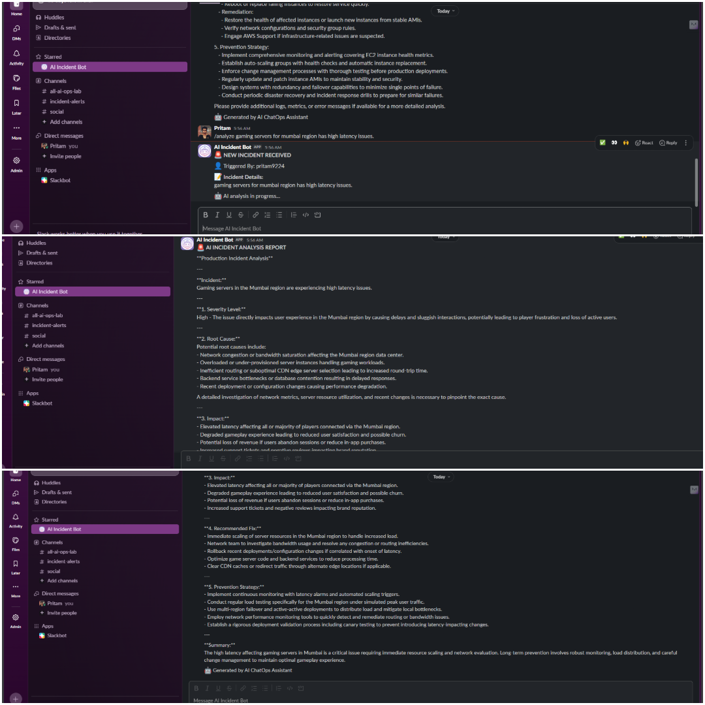
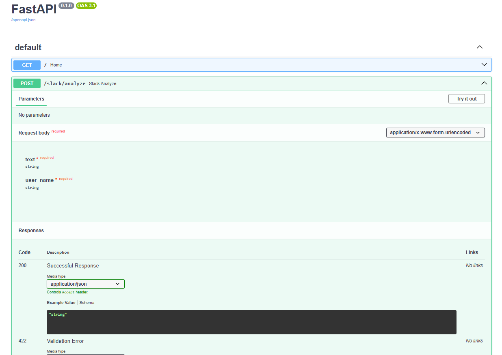

# 🚨 AI-Powered Incident ChatOps Assistant


> Production issue hits.  
> Alerts start flooding.  
> Slack channels explode.  
> Engineers scramble through logs, dashboards, and monitoring tools trying to identify the root cause.

This project was built to automate the **first-response operational workflow** using AI-powered ChatOps.

The assistant receives production incidents directly from Slack, performs AI-driven incident analysis, and responds with:
- Severity Assessment
- Root Cause Analysis (RCA)
- Impact Analysis
- Recommended Fixes
- Prevention Strategies

All in real time.

---

# ⚡ What This Project Solves

Modern DevOps and Cloud teams deal with:
- alert fatigue
- slow incident triaging
- repetitive operational debugging
- scattered communication during outages

This project acts as an **AI operational assistant** integrated into Slack workflows to accelerate incident understanding and response.

Instead of manually:
- checking logs
- searching dashboards
- asking multiple teams
- drafting RCAs

Engineers can simply trigger:

```bash
/analyze Production API returning intermittent 503 errors
````

And receive AI-assisted operational analysis directly inside Slack.

---

# 🧠 Core Workflow

```text
Slack Slash Command
        ↓
FastAPI Backend
        ↓
Async Background Processing
        ↓
OpenAI API Analysis
        ↓
Slack Incident Response
```

---

# 🔥 Live Workflow Example

## 1️⃣ Engineer reports issue in Slack

```bash
/analyze EC2 instances failing health checks after deployment
```

---

## 2️⃣ Bot immediately acknowledges incident

```text
🚨 NEW INCIDENT RECEIVED

👤 Triggered By: pritam9224

📝 Incident Details:
EC2 instances failing health checks after deployment

🤖 AI analysis in progress...
```

---

## 3️⃣ AI-generated operational analysis appears automatically

```text
🚨 AI INCIDENT ANALYSIS REPORT

Severity: HIGH

Root Cause:
Deployment introduced unhealthy application instances causing failed health checks.

Impact:
Traffic routing instability and intermittent downtime observed.

Recommended Fix:
- Roll back latest deployment
- Verify target group health checks
- Inspect application logs
- Validate environment variables

Prevention Strategy:
- Implement canary deployments
- Add deployment health validation
- Improve monitoring and rollback automation
```

---

# 🚀 Features

✅ Slack Slash Command Integration
✅ AI-Powered Incident Analysis
✅ Async Background Processing
✅ Real-Time ChatOps Workflow
✅ FastAPI Backend
✅ OpenAI API Integration
✅ Slack Webhook Automation
✅ Operational RCA Generation
✅ Severity Assessment
✅ Cloud/DevOps Incident Handling
✅ Multi-step Incident Workflow
✅ Production-style Operational Design

---

# 🛠 Tech Stack

| Technology             | Purpose                             |
| ---------------------- | ----------------------------------- |
| Python                 | Backend Development                 |
| FastAPI                | API Framework                       |
| OpenAI API             | AI Incident Analysis                |
| Slack API              | ChatOps Integration                 |
| Slack Webhooks         | Automated Messaging                 |
| ngrok                  | Public Tunnel for Local Development |
| Uvicorn                | ASGI Server                         |
| Async Background Tasks | Non-blocking Processing             |

---

# ⚙️ Project Architecture

```text
┌──────────────────────┐
│      Slack User      │
└──────────┬───────────┘
           │
           ▼
┌──────────────────────┐
│  Slack Slash Command │
└──────────┬───────────┘
           │
           ▼
┌──────────────────────┐
│    FastAPI Backend   │
└──────────┬───────────┘
           │
           ▼
┌──────────────────────┐
│ Async Background Job │
└──────────┬───────────┘
           │
           ▼
┌──────────────────────┐
│     OpenAI API       │
└──────────┬───────────┘
           │
           ▼
┌──────────────────────┐
│ Slack AI RCA Report  │
└──────────────────────┘
```

---

# 📂 Project Structure

```text
ai-chatops-assistant/
│
├── chatops_bot.py
├── requirements.txt
├── .gitignore
├── README.md
│
├── screenshots/
├── architecture/
└── sample_logs/
```

---

# 🔐 Security Considerations

Sensitive credentials such as API keys are stored securely using:

```text
.env
```

The `.env` file is excluded from version control using:

```text
.gitignore
```

---

# 🧪 Running the Project Locally

## 1️⃣ Clone Repository

```bash
git clone https://github.com/pritamwankhede9224/ai-chatops-assistant.git
```

---

## 2️⃣ Install Dependencies

```bash
pip install -r requirements.txt
```

---

## 3️⃣ Configure Environment Variables

Create a `.env` file:

```env
OPENAI_API_KEY=your_openai_api_key
SLACK_WEBHOOK_URL=your_slack_webhook_url
```

---

## 4️⃣ Run FastAPI Server

```bash
python -m uvicorn chatops_bot:app --reload
```

---

## 5️⃣ Start ngrok Tunnel

```bash
ngrok http 8000
```

---

## 6️⃣ Configure Slack Slash Command

Example:

```text
/analyze
```

Request URL:

```text
https://your-ngrok-url/slack/analyze
```

---

# 🧠 Engineering Concepts Practiced

This project helped reinforce practical understanding of:

* API integrations
* Webhooks
* ChatOps workflows
* Async backend processing
* AI orchestration
* Incident response automation
* Slack bot integrations
* Operational tooling
* Cloud/DevOps workflow design
* Background task execution

---

# 💡 Key Takeaways

Building this project helped me better understand:

- Async operational workflows
- Slack webhook integrations
- AI orchestration patterns
- Real-time incident automation
- Backend API lifecycle handling
- Practical ChatOps architecture

---

# ⚠️ Current Limitations

- Local development currently uses ngrok tunneling
- AI responses depend on external API latency
- No persistent incident storage implemented yet
- Multi-user context handling is limited

---
# 🔮 Future Enhancements

* AWS CloudWatch Integration
* ServiceNow/Jira Ticket Creation
* Multi-cloud Incident Support
* AI Severity Scoring Engine
* Incident Memory & Historical Context
* Real-time Monitoring Integration
* Kubernetes Alert Handling
* PagerDuty Integration
* Multi-channel Notifications
* AI-driven Automated Remediation

---

# 📸 Screenshots & Live Workflow

## 🚨 Incident Trigger Workflow

The engineer triggers an incident analysis directly from Slack using the `/analyze` slash command.



---

## 🤖 AI Incident Analysis Response

The AI assistant automatically performs operational analysis and generates:
- Severity Assessment
- Root Cause Analysis
- Impact Summary
- Recommended Fixes
- Prevention Strategies

Directly inside Slack.



---

## ⚙️ FastAPI Backend Documentation

Interactive FastAPI Swagger documentation exposing operational endpoints used by the ChatOps assistant.



---

# 🤝 Why This Project Matters

This project is not intended to replace engineers.

It is designed to assist operational teams by:

* reducing repetitive investigation effort
* accelerating incident triaging
* improving operational visibility
* enabling faster first-response workflows

The focus is on practical AI integration into real operational systems — not just building another chatbot.

---

# 👨‍💻 Author

### Pritam Wankhede

Cloud / DevOps Engineer focused on:

* AWS
* Azure
* CI/CD
* Infrastructure Automation
* AI-Integrated Operational Workflows

---

```
```
